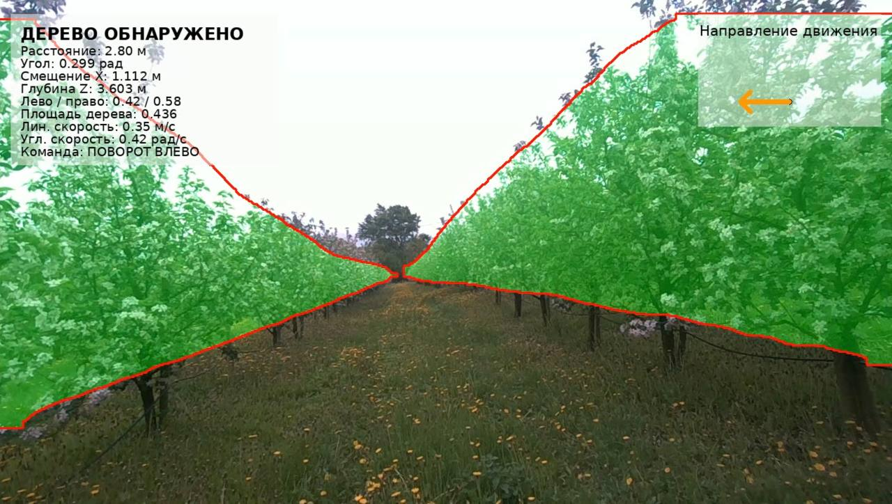

[](https://www.python.org/)
[](https://docs.ros.org/en/humble/)
[](https://opencv.org/)
[](https://pytorch.org/)
[](https://ultralytics.com/)

# Система обнаружения деревьев для автономной навигации робота

Проект представляет собой прототип системы компьютерного зрения для обнаружения деревьев в саду и формирования навигационных параметров автономного робота.

Система использует обученную модель YOLO-seg для сегментации деревьев, совмещает маску дерева с depth-кадром и рассчитывает расстояние, смещение и угол до дерева. На основе этих данных формируется команда движения робота в ROS 2.

___
## Основной пайплайн

```text
RealSense RGB-D bag
        ↓
YOLO-seg segmentation
        ↓
tree mask
        ↓
depth-based 3D postprocessing
        ↓
tree distance / angle / offset
        ↓
/cmd_vel
        ↓
debug visualization
```

___
## Что реализовано

* подготовка датасета для YOLO-seg;
* обучение модели сегментации классов `tree` и `road`;
* ROS 2-пакет `orchard_nav_system`;
* публикация RGB-D данных из RealSense `.bag`;
* инференс YOLO-seg в ROS 2;
* расчет расстояния и положения дерева по depth-кадру;
* формирование команды движения `/cmd_vel`;
* визуализация результата поверх RGB-кадра;
* запись демонстрационного видео.

___
## Метрики модели

| Класс | mAP50 | mAP50-95 |
| ----- | ----: | -------: |
| tree  | 0.988 |    0.834 |
| road  | 0.988 |    0.840 |
| all   | 0.988 |    0.837 |

___
## Основные ROS 2-ноды

| Нода                      | Назначение                                         |
| ------------------------- | -------------------------------------------------- |
| `realsense_bag_publisher` | публикует RGB и depth из RealSense `.bag`          |
| `yolo_seg_node`           | запускает YOLO-seg и публикует маску дерева        |
| `tree_distance_node`      | рассчитывает расстояние, смещение и угол до дерева |
| `robot_control_node`      | формирует команду движения `/cmd_vel`              |
| `visualization_node`      | рисует итоговую визуализацию                       |
| `video_recorder_node`     | сохраняет демонстрационное видео                   |

___
## Основные топики

| Топик                          | Назначение            |
| ------------------------------ | --------------------- |
| `/camera/rgb/image_raw`        | RGB-кадр              |
| `/camera/depth/image_raw`      | depth-кадр            |
| `/segmentation/tree_mask`      | маска дерева          |
| `/perception/tree_info`        | параметры дерева      |
| `/cmd_vel`                     | команда движения      |
| `/visualization/debug_overlay` | итоговая визуализация |

Формат `/perception/tree_info`:

```text
[distance_m, mean_x_m, mean_z_m, angle_rad, left_ratio, right_ratio, tree_area_ratio, valid]
```

___
## Запуск ROS 2-пайплайна
```bash
cd ~/ros2_ws
source /opt/ros/humble/setup.bash
source install/setup.bash
ros2 launch orchard_nav_system orchard_nav.launch.py
```

___
## Просмотр визуализации
```bash
ros2 run rqt_image_view rqt_image_view
```

___
## Запись демонстрационного видео

Начать запись:
```bash
source /opt/ros/humble/setup.bash
source ~/ros2_ws/install/setup.bash

ros2 run orchard_nav_system video_recorder_node --ros-args \
  -p image_topic:=/visualization/debug_overlay \
  -p output_path:=/home/h/orchard_nav_demo.mp4 \
  -p fps:=25.0
```

Остановить запись:
```text
Ctrl+C
```

___
## Структура проекта
```text
.
├── model_core/
│   ├── dataset/
│   │   ├── train/
│   │   │   ├── images/
│   │   │   └── labels/
│   │   ├── val/
│   │   │   ├── images/
│   │   │   └── labels/
│   │   └── data.yaml
│   ├── data/
│   │   └── dataset.pkl
│   ├── train/
│   ├── masks/
│   ├── yolo_seg_labels/
│   ├── bboxes/
│   ├── runs/
│   ├── models/
│   ├── notebooks/
│   └── utils/
│
├── orchard_nav_system/
│   ├── config/
│   │   └── params.yaml
│   ├── launch/
│   │   └── orchard_nav.launch.py
│   ├── orchard_nav_system/
│   │   ├── __init__.py
│   │   ├── realsense_bag_publisher.py
│   │   ├── yolo_seg_node.py
│   │   ├── tree_distance_node.py
│   │   ├── robot_control_node.py
│   │   ├── visualization_node.py
│   │   └── video_recorder_node.py
│   ├── resource/
│   ├── package.xml
│   ├── setup.cfg
│   └── setup.py
│
├── requirements.txt
├── README.md
├── .gitignore
└── LICENSE
```

___
## Ограничения
* тестирование выполнено на записанном RealSense `.bag`, а не на реальном роботе;
* фактический FPS ограничен скоростью чтения `.bag`;
* управление пока реактивное, без полноценного SLAM/Nav2;
* система является исследовательским прототипом.

___
## Пример работы
```markdown

```